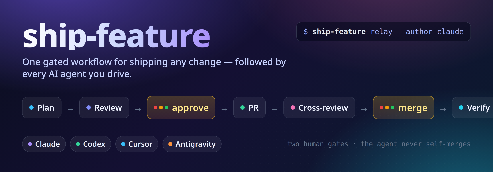

# ship-feature



<div align="center">

[](LICENSE)
[](bin/ship-feature)
[](https://github.com/hamen/ship-feature/actions/workflows/test.yml)
[](https://docs.anthropic.com/en/docs/claude-code)
[](https://github.com/openai/codex)
[](https://cursor.com)
[](https://antigravity.dev)
[](https://github.com/hamen/pr-review-relay)

**One gated workflow for shipping any repository change — followed by whichever AI agent you drive.**

</div>

---

Plan → review → implement → cross-review → merge → verify, with **two human approval gates** and the
agent **never merging its own work**. The process lives in one place — [`WORKFLOW.md`](WORKFLOW.md) — and
each driver agent (Claude, Codex, Cursor) gets a thin adapter that points at it, so you stop re-explaining
"how we ship" every session. Antigravity joins the **cross-review** step through
[`pr-review-relay`](https://github.com/hamen/pr-review-relay).

## 🆕 What's new

**v0.1.0** — first release: the canonical `WORKFLOW.md`, a `ship-feature` CLI (`preflight` +
a transparent `relay` wrapper), thin adapters for Claude / Codex / Cursor, an idempotent `install.sh`,
and a two-layer privacy guard. Full history in the [CHANGELOG](CHANGELOG.md).

## Why

Agents reinvent your release/PR process every session — worktree or not, which review, when to merge.
`ship-feature` encodes it once, as instructions an agent actually follows, with the irreversible steps
(approve the plan, merge) held behind explicit human gates.

## The workflow

The authoritative version is [`WORKFLOW.md`](WORKFLOW.md). At a glance:

| Step | What happens | Gate |
|:----:|--------------|:--|
| 1 | **Plan** the change | |
| 2 | A second agent **reviews the plan** | |
| 3 | You **approve the plan** | 🚦 **human gate** |
| 4 | **Implement** in a worktree → open a **PR** | |
| 5 | **Cross-review + tests** — keep iterating while any Blocker / Should-fix remains | |
| 6 | You **merge** | 🚦 **human gate** |
| 7 | **Verify** on the merge commit | |

The two 🚦 gates are the only places the agent stops and waits for you — and the agent never merges its
own work. Everything else runs on its own.

## Install

Requires [**`pr-review-relay`**](https://github.com/hamen/pr-review-relay) on your `PATH` — it powers the
cross-review step (step 5). Then:

```bash
git clone https://github.com/hamen/ship-feature
cd ship-feature
./install.sh          # or ./install.sh --copy to detach WORKFLOW.md from the clone
```

`install.sh` is idempotent: it symlinks the CLI, installs `WORKFLOW.md` to `~/.config/ship-feature/`, the
workflow skill to `~/.agents/skills/`, a Cursor rule, and a marked block in `~/.codex/AGENTS.md`
(backing up anything it changes). Add a line to your global agent instructions telling it to follow the
ship-feature skill for any feature/fix.

## The CLI

- `ship-feature preflight` — assert you're in a feature worktree branched off the default branch, with
  the worktree marker git-excluded (run before you start implementing).
- `ship-feature plan-review [<file>] [--reviewers a,b,c] [--parallel]` — step 2: fan an implementation
  plan (a file, stdin, or `./plan.md`) out to a panel of agents for a **read-only** review and print each
  one. Defaults the panel to `SHIP_FEATURE_REVIEWERS`; nothing is written or posted. Exit `0` = every
  reviewer responded, `3` = one failed/timed out/returned empty (re-run), `1` = usage error. Lets you say
  "review this plan with codex and qwen" as one command.
- `ship-feature relay [args…]` — a **transparent** wrapper over
  [`pr-review-relay`](https://github.com/hamen/pr-review-relay) that preserves its stdout and exact exit
  code, and reminds you what each code means (`0` = everyone ran, not "clean"; `3` = re-run;
  `4` = escalate). It injects your configured reviewer quorum when you omit `--reviewers`.

State/resume (`new`/`status`) is intentionally deferred — the CLI stays a thin helper; the agent drives
the process from `WORKFLOW.md`.

## Keeping it clean (privacy)

This repo is generic — no private, project-specific data. Two guards:

- **`scripts/scan-generic.sh`** (CI) — catches real emails and absolute home paths; needs no config, runs
  on fork PRs.
- **`scripts/scan-personal-data.sh`** (local, pre-publication) — greps full history, commit metadata,
  filenames, and ref names against a **private** newline-delimited deny-list file (never `source`-d).

Your machine-specific values live in `~/.config/ship-feature/config` (gitignored) — see
[`config.example`](config.example).

## License

MIT © 2026 [Ivan Morgillo](https://github.com/hamen) — see [LICENSE](LICENSE).
