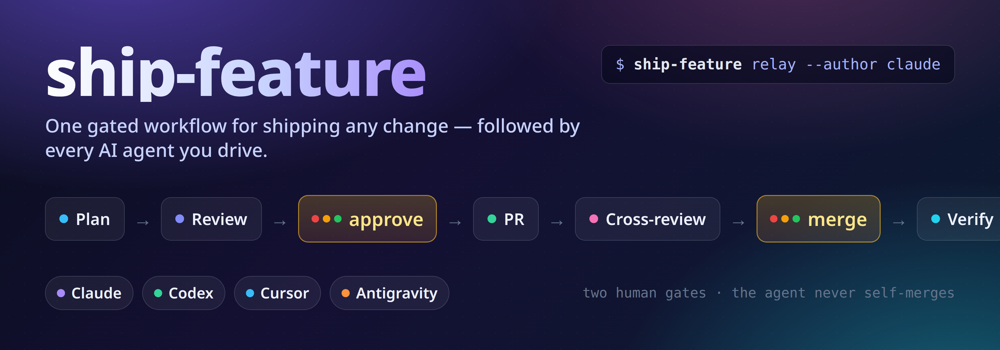

# ship-feature



<div align="center">

[](LICENSE)
[](bin/ship-feature)
[](https://github.com/hamen/ship-feature/actions/workflows/test.yml)
[](https://docs.anthropic.com/en/docs/claude-code)
[](https://github.com/openai/codex)
[](https://cursor.com)
[](https://antigravity.dev)
[](https://github.com/hamen/pr-review-relay)

**One gated workflow for shipping any repository change — followed by whichever AI agent you drive.**

</div>

---

Plan → review → implement → cross-review → merge → verify, with **two human approval gates** and the
agent **never merging its own work**. The process lives in one place — [`WORKFLOW.md`](WORKFLOW.md) — and
each driver agent (Claude, Codex, Cursor) gets a thin adapter that points at it, so you stop re-explaining
"how we ship" every session. Antigravity joins the **cross-review** step through
[`pr-review-relay`](https://github.com/hamen/pr-review-relay).

## 🆕 What's new

**v0.5.0** — **one file configures the whole panel, and the panel gains a Gemini seat.** The seats,
their models and the per-reviewer timeout were spread across two config files that were free to
disagree, and nothing complained when they did: `ship-feature` and `pr-review-relay` could run the
same named seat on two different models, or the same round on two different clocks, from inputs that
were each individually valid. `~/.config/pr-review-relay/config` is now the single place the panel is
defined — `REVIEWERS`, `PLAN_REVIEWERS`, `MODEL_*` and `AGENT_TIMEOUT` are all read from it, with the
environment and ship-feature's own config still winning above it. The timeout default moves to 500s,
after a session lost three consecutive `grok45high` attempts to a 300s clock on a plan whose only
fault was being thorough.

**`antigravity`** (aliases `agy`, `gemini`) becomes a real plan reviewer rather than a name that was
silently skipped, running the `gemini` CLI fail-closed: an isolated `GEMINI_CLI_HOME` and workspace
with all four settings scopes redirected to controlled files, a locked `settings.json` that
allowlists only read-only tools, hooks off and no MCP. Because that allowlist does not cover every
tool gemini registers, the seat also **refuses to run against a gemini-cli whose tool registry has
not been audited** — `SHIP_FEATURE_GEMINI_TESTED_VERSIONS`, matched exactly, so a patch release does
not ride in on its neighbour. A panel that lists `antigravity` now requires the binary instead of
thinning itself silently. `kimi3` gained read access to the checkout it reviews.

Also fixed: the macOS CI job had been failing since 2026-08-15 on `grep: maximum repetition exceeds
255` — BSD grep refusing an interval bound the adapter-consistency patterns used, reported as
"missing from every adapter", which named the wrong cause and was invisible on Linux.

**v0.4.0** — **the plan-review panel runs in parallel, and knows when to stop.** Reviewers are
independent, so running them one after another only serialized their timeouts: a four-seat panel at a
300s cap could sit for twenty minutes before printing a verdict, and one real session lost two seats
to timeouts before the third had even started. Parallel is now the default (`--sequential` opts out).
Step 2 also gets its own **2-round cap** — its "iterate (≈2 rounds)" was a suggestion, not a rule, and
one session ran 13 rounds before the panel agreed, burning ~1h15m on convergence instead of on the
plan. Plan-review now stops after round 2 with an open **plan-qualifying** finding (the plan is wrong,
unsafe, or materially incomplete — a distinct term from step 5's PR-qualifying Should-fix) and hands
Gate 1 a **disagreement summary** instead of grinding for consensus; a clean round 1 skips a wasted
round 2 entirely. `WORKFLOW.md`, all three adapters, and the CLI's plan-review message state the same
rule, checked by the same consistency suite as step 5. Plus `GROK45HIGH_REVIEW_MODEL` and
`KIMI3_REVIEW_MODEL`, so a reviewer can be re-pinned when its vendor ships a new model without waiting
for a release.

**v0.3.0** — **the review panel is given the plan, and stops iterating on findings that change
nothing.** Reviewers used to see only the diff, so they could find bugs but never *"this is not what
we agreed to build"* — `--context-file` now carries the plan on every round. And the loop runs in
three named phases (full panel → narrow fix rounds → a closing full panel on the SHA that merges)
instead of iterating on every Should-fix, which had produced eight full-quorum rounds on one PR where
the last five found no Blocker. Both rules live in `WORKFLOW.md`, all three adapters **and** the CLI's
own message — and a consistency suite now fails if any of those five drift apart, in either direction.

**v0.2.0** — **`ship-feature plan-review`**: step 2 as a first-class command, fanning an
implementation plan out to a panel of agents for a read-only review before any code is written.

**v0.1.0** — first release: the canonical `WORKFLOW.md`, a `ship-feature` CLI (`preflight` +
a transparent `relay` wrapper), thin adapters for Claude / Codex / Cursor, an idempotent `install.sh`,
and a two-layer privacy guard. Full history in the [CHANGELOG](CHANGELOG.md).

## Why

Agents reinvent your release/PR process every session — worktree or not, which review, when to merge.
`ship-feature` encodes it once, as instructions an agent actually follows, with the irreversible steps
(approve the plan, merge) held behind explicit human gates.

## The workflow

The authoritative version is [`WORKFLOW.md`](WORKFLOW.md). At a glance:

| Step | What happens | Gate |
|:----:|--------------|:--|
| 1 | **Plan** the change | |
| 2 | A second agent **reviews the plan** (capped at 2 rounds; open disagreement → Gate 1) | |
| 3 | You **approve the plan** | 🚦 **human gate** |
| 4 | **Implement** in a worktree → open a **PR** | |
| 5 | **Cross-review + tests** — the panel gets the **plan**, and iterates only for a Blocker or a *qualifying* Should-fix | |
| 6 | You **merge** | 🚦 **human gate** |
| 7 | **Verify** on the merge commit | |

The two 🚦 gates are the only places the agent stops and waits for you — and the agent never merges its
own work. Everything else runs on its own.

**Step 5 in one paragraph.** The reviewers are given the **plan** (`--context-file`), not just the
diff, so they can say *"this is not what we agreed to build"* and not only *"this line is wrong"*.
Round 1 is the full panel; the fix rounds are **narrow** — the reviewers with a stake in an open
finding, plus anyone whose finding you downgraded, so nobody is classified out of their own
objection; the closing round is the full panel again, on the SHA that will merge, unless round 1 was
already clean and there was nothing to fix. Iterating happens for
a **Blocker** or a **qualifying** Should-fix (correctness, safety, deployability, verification), not
for every remark. Anything the author downgrades is written down, and if the reviewer still disagrees
it goes to you at the merge gate — which is a change to what that gate *receives*, not a third gate.

## Install

Requires [**`pr-review-relay`**](https://github.com/hamen/pr-review-relay) on your `PATH` — it powers the
cross-review step (step 5). Then:

```bash
git clone https://github.com/hamen/ship-feature
cd ship-feature
./install.sh          # or ./install.sh --copy to detach WORKFLOW.md from the clone
```

`install.sh` is idempotent: it symlinks the CLI, installs `WORKFLOW.md` to `~/.config/ship-feature/`, the
workflow skill to `~/.agents/skills/`, a Cursor rule, and a marked block in `~/.codex/AGENTS.md`
(backing up anything it changes). Add a line to your global agent instructions telling it to follow the
ship-feature skill for any feature/fix.

## The CLI

- `ship-feature preflight` — assert you're in a feature worktree branched off the default branch, with
  the worktree marker git-excluded (run before you start implementing).
- `ship-feature plan-review [<file>] [--reviewers a,b,c] [--sequential]` — step 2: fan an implementation
  plan (a file — keep it in `~/.config/ship-feature/plans/`, see WORKFLOW.md §1 — or stdin) out to a panel
  of agents for a **read-only** review and print each
  one. The panel runs **in parallel by default** — the reviewers are independent, so running them one
  after another only serializes their timeouts, and a four-seat panel at the per-reviewer timeout each can sit for many
  minutes before it prints a verdict. Pass `--sequential` to run them one at a time and stream each
  review as it lands. Read-only means each reviewer is pinned to its CLI's read-only mode and none is given a way to
  write your checkout or post anywhere — see [`WORKFLOW.md`](WORKFLOW.md) for what that does and does not
  guarantee for reviewers that run inside the checkout. Defaults the panel to `SHIP_FEATURE_PLAN_REVIEWERS`, then `SHIP_FEATURE_REVIEWERS`; nothing is
  written or posted. Supported reviewers
  are the ones that can actually be constrained: `claude` (`--permission-mode plan --safe-mode`), `codex`
  (`--sandbox read-only`), `cursor` (ask/Q&A mode, pinned to `--model composer-2.5`; see
  [Why the Cursor model is pinned](#why-the-cursor-model-is-pinned)), `kimi3` (Kimi K3 via opencode: `OPENCODE_CONFIG_CONTENT`
  — opencode's highest-precedence config layer — denies the `edit`+`bash` permissions so it can't write
  even via shell and can't be overridden by a merged global/checkout config; inherited `OPENCODE_CONFIG*`
  are unset, it runs in an isolated cwd outside the checkout, plus `--pure` and `--agent plan`),
  `grok45high` (Grok 4.6 high effort — pin with `GROK45HIGH_REVIEW_MODEL`, from the config file or the
  environment, same contract as `CURSOR_REVIEW_MODEL` below: `grok --prompt-file` — headless Grok ignores stdin — running in
  your checkout like `claude`/`codex`/`cursor`, held read-only by a tool **allowlist**
  `--tools read_file,list_dir,grep`, with the MCP bridge removed explicitly
  (`--disallowed-tools search_tool,use_tool` — it survives the built-in allowlist), plus
  `--permission-mode plan` and `--sandbox read-only`),
  and `antigravity` (aliases `agy`, `gemini`) via the `gemini` CLI, run **fail-closed**: an isolated
  `GEMINI_CLI_HOME` and working dir with a locked `.gemini/settings.json` that allowlists only the
  read-only tools via `tools.core`, names today's write tools in `tools.exclude` as defence-in-depth,
  disables hooks, and declares no MCP — so neither the user's real `~/.gemini` nor a reviewed checkout's
  `.gemini/` contributes any `mcpServers`, hooks, or `tools.allowed`. `tools.core` is an allowlist but
  not a universal one — gemini registers some tools outside it — so the seat additionally **refuses to
  run against an unaudited gemini-cli**: only the exact versions listed in
  `SHIP_FEATURE_GEMINI_TESTED_VERSIONS` (default `0.26.0`) are accepted — a patch release can add a tool
  as easily as a minor one — and the version is probed inside the same isolation the review runs in. Model pinned to
  `gemini-3.1-pro-preview` (the CLI's own default is a retired model that 404s); override with
  `SHIP_FEATURE_GEMINI_MODEL` or `MODEL_gemini` in the shared panel file. Tradeoff: the isolated run
  sees only the plan text, not the checkout's files. The `antigravity` name maps to the `gemini` CLI
  here but to `agy` in `relay` — only `gemini` has a read-only mode.
  `--safe-mode` on claude also stops any hooks/plugins/MCP in the checkout from loading.
  Bare `opencode` and bare `grok` are
  relay-only and skipped with a warning (a plain `opencode run` uses the
  all-allow `build` agent — only the `kimi3` reviewer pins the read-only opencode `plan` agent; bare
  `grok` is the PR-relay name — use `grok45high` here). The
  panel is your quorum — **omit `--reviewers` and it is taken from your config**
  (`SHIP_FEATURE_PLAN_REVIEWERS`, then `SHIP_FEATURE_REVIEWERS`; each from the **environment**
  first, then `~/.config/ship-feature/config`, else `PLAN_REVIEWERS` / `REVIEWERS` in
  `~/.config/pr-review-relay/config` — set them in ONE place, and note an exported value beats both
  files, so a stale one in a shell profile silently reduces the panel); pass the flag only to override on purpose, because a typed
  list is a copy of that config that goes stale the day a seat is added. A supported reviewer whose
  CLI is missing **fails** the round rather than thinning it — but a **relay-only** name in the set
  (bare `opencode`, bare `grok`) is skipped with a warning and the round still exits `0`, so read
  the startup lines. Exit `0` = every reviewer that RAN responded (which is not the same as
  everyone running), `3` = one failed/timed out/returned empty (re-run),
  `1` = usage error. Per-reviewer timeout resolves highest-first: `SHIP_FEATURE_PLAN_TIMEOUT` (the
  environment, then `~/.config/ship-feature/config`), then `PR_RELAY_AGENT_TIMEOUT` from the
  environment, then **`AGENT_TIMEOUT` in `~/.config/pr-review-relay/config`** — the one place to set
  it for this tool and `pr-review-relay` at once — then `500`s. Lets you say "review this plan with codex and kimi3" as one command.
- `ship-feature relay [args…]` — a **transparent** wrapper over
  [`pr-review-relay`](https://github.com/hamen/pr-review-relay) that preserves its stdout and exact exit
  code, and reminds you what each code means: `0` = every **dispatched** reviewer ran — not that
  everyone ran, since a benched (out-of-quota) seat is dropped and still exits `0` — and not "clean";
  `3` = re-run; `4` = escalate. It injects your configured reviewer quorum when you omit
  `--reviewers` — **which is how it should normally be run**: the config is the panel, and a typed
  list can only be staler than it. Pass the flag for a narrow follow-up round, or to override. Read
  each round's startup lines either way: omitting the flag fixes a stale list, it cannot tell you a
  seat dropped out.

State/resume (`new`/`status`) is intentionally deferred — the CLI stays a thin helper; the agent drives
the process from `WORKFLOW.md`.

## Why the Cursor model is pinned

`plan-review` invokes the Cursor reviewer with `--model "$CURSOR_REVIEW_MODEL"`
(default `composer-2.5`). Left off, `cursor-agent` uses whatever is in your
`~/.cursor/cli-config.json`, which out of the box is **Auto** — and Auto routes to the frontier
models, including Claude's.

That matters more here than anywhere else in the pipeline. `plan-review` is the check on a plan that
an agent — usually Claude — just wrote, immediately before a human approves it. If Auto picks a
Claude model, Claude grades its own plan while the panel prints it as an independent "Cursor"
reviewer. The gate still reports two reviewers; you actually have one. Pinning to a model from a
different family is what keeps the second opinion a second opinion.

It also stops the reviews from billing Cursor's small *Other Models* quota (Claude/GPT) instead of
the much larger Cursor-branded pool — a real problem for a command you run before every change.

The default is **Composer 2.5, Cursor's own model**: Cursor-pool, and not Claude, GPT, Codex or
Grok. Every reviewer on the panel then stays on the model its own vendor built, which keeps them
failing differently from each other and not just from the author.

Override with `CURSOR_REVIEW_MODEL`; `cursor-agent --list-models` shows what your account offers.
**Pick something outside the other reviewers' families.** Setting it back to `auto`, to a
`claude-*` id while Claude writes your plans, or to a `cursor-grok-*` id while `grok45high` is on
your panel, all collapse two nominally independent seats onto one model family — the override
exists for retired model ids, not for going back to Auto.
The variable has no `SHIP_FEATURE_` prefix on purpose: it describes your Cursor account rather than
this tool, [`pr-review-relay`](https://github.com/hamen/pr-review-relay) reads the same one, and a
single setting should configure both. It **is** read from config (and exported when read, so the
relay child process sees it). Three sources, highest first: the environment,
`~/.config/ship-feature/config`, and finally `pr-review-relay`'s own config as `MODEL_cursor`.

## Overriding the kimi3 model

`plan-review` invokes the `kimi3` reviewer with `opencode run --pure --agent plan -m
"$KIMI3_REVIEW_MODEL"` (default `opencode-go/kimi-k3`, the bundled OpenCode Go tier). Override with
`KIMI3_REVIEW_MODEL` to route it at a different model instead — for example a pay-as-you-go
OpenRouter id (`openrouter/z-ai/glm-5.2`) if you want kimi3 off the bundled subscription tier
without waiting on its quota reset. `opencode models` lists what your account can reach.

Same convention as `CURSOR_REVIEW_MODEL`: no `SHIP_FEATURE_` prefix, read from
`~/.config/ship-feature/config` with the environment winning, and from `pr-review-relay`'s own
config as `MODEL_kimi3` below that — which is normally where a pin belongs, since both tools drive
the same seats on the same accounts. The config SOURCE is shared; the SEAT is not — unlike `CURSOR_REVIEW_MODEL`, this reviewer has no counterpart in
`pr-review-relay` — that tool's opencode reviewer has its own separate override,
`PR_RELAY_OPENCODE_MODEL`, for a different code path (the relay's `opencode` seat, not
plan-review's `kimi3` seat).

## Running the tests

```bash
bash test/test-ship-feature.sh
```

Needs **git 2.31+**. The suite isolates its fixtures from your own git environment — signing, hooks,
`core.excludesFile`, and the `GIT_DIR` family that git hands to hooks — using `GIT_CONFIG_COUNT`,
which arrived in 2.31. On an older git it refuses to run rather than applying half the isolation and
reporting green. That isolation is why the suite behaves the same whether or not your commit signing
is on, and why running it from a git hook cannot write into the repository being tested.

## Keeping it clean (privacy)

This repo is generic — no private, project-specific data. Two guards:

- **`scripts/scan-generic.sh`** (CI) — catches real emails and absolute home paths; needs no config, runs
  on fork PRs.
- **`scripts/scan-personal-data.sh`** (local, pre-publication) — greps full history, commit metadata,
  filenames, and ref names against a **private** newline-delimited deny-list file (never `source`-d).

Your machine-specific values live in `~/.config/ship-feature/config` (gitignored) — see
[`config.example`](config.example).

## License

MIT © 2026 [Ivan Morgillo](https://github.com/hamen) — see [LICENSE](LICENSE).
